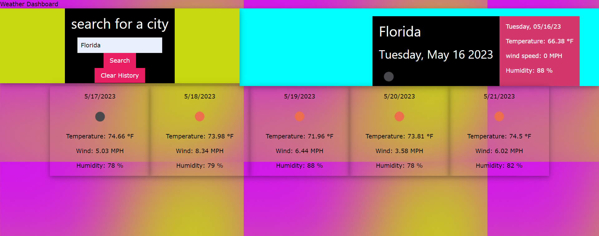

# Weather Dashboard API

 ## Table of Contents 

  * [Description](#description)
  * [Technologies](#technologies)
  * [Usage](#usage)
  * [Screenshots](#screenshots)
  * [Contributers](#contributers)
  * [License](#license)

## Description

This site was created to be able to search current weather and weather forecasts for any city in the world.

## Technologies

* HTML
* CSS
* Javascript
* DayJS
* JQuery
* Open Weather Map API
* W3 School CSS Framework

## Installation

No installation necessary. Visit the deployed website and search for any city.

## Usage

Open up deployed application and enter city name into search bar and click search. This will bring current and five day weather forecast information pertaining to that city.

## Screenshots

## Contributers

 [Carisse Barr](https://github.com/carissella)

 ## License

 Copyright (c) [MIT](https://opensource.org/licences/MIT)

 ## Questions 

  You can visit my Github Profile here: [Carissella](https://github.com/carissella) 
  If you have any questions please email me at carissebarr.swe@gmail.com